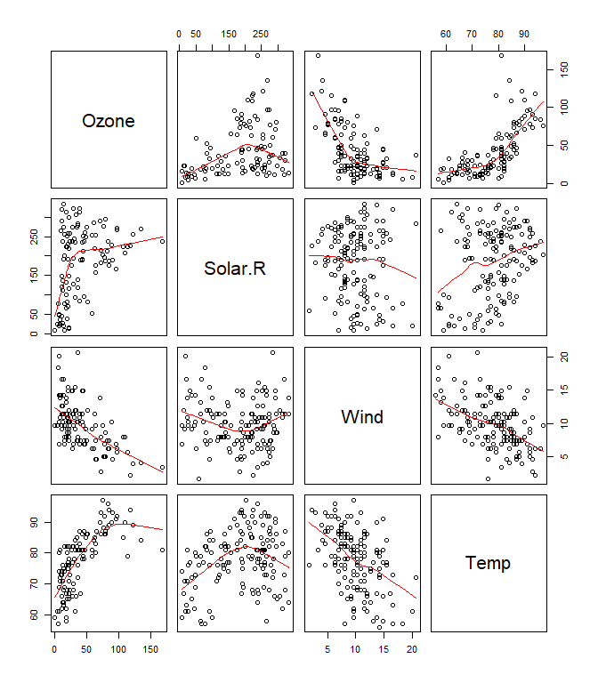
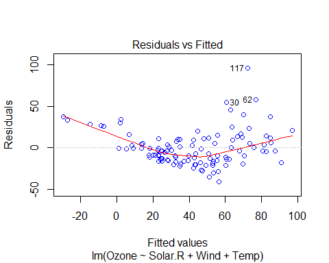
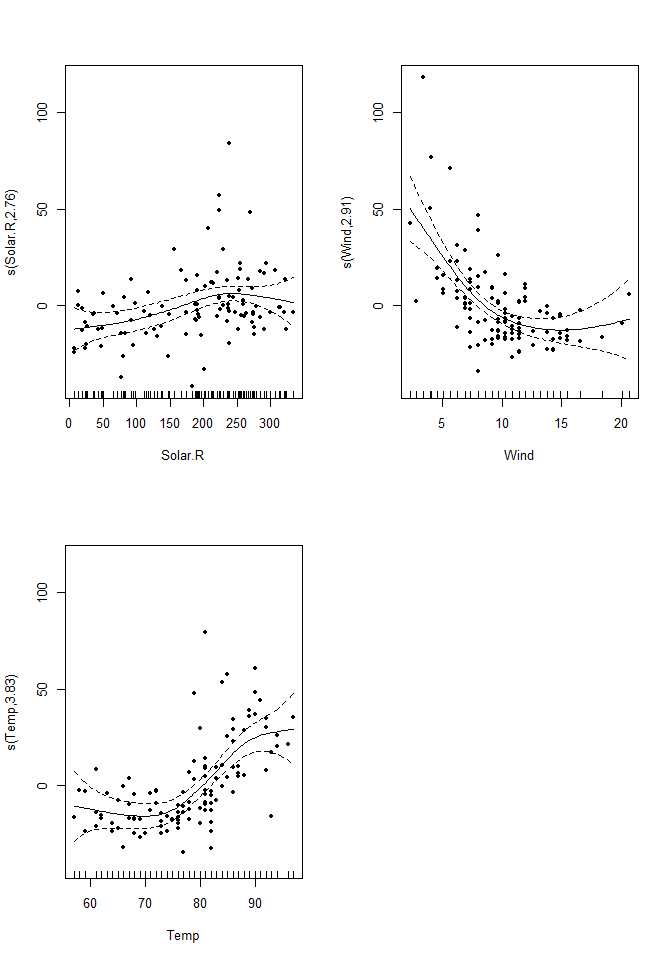
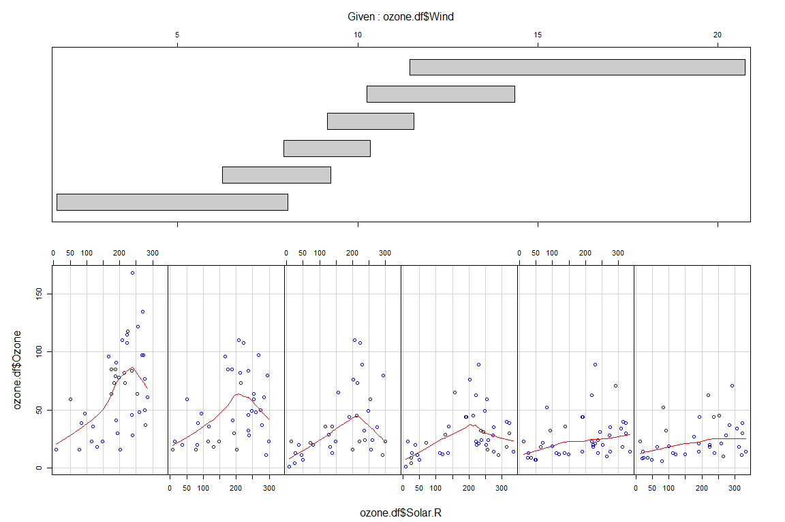
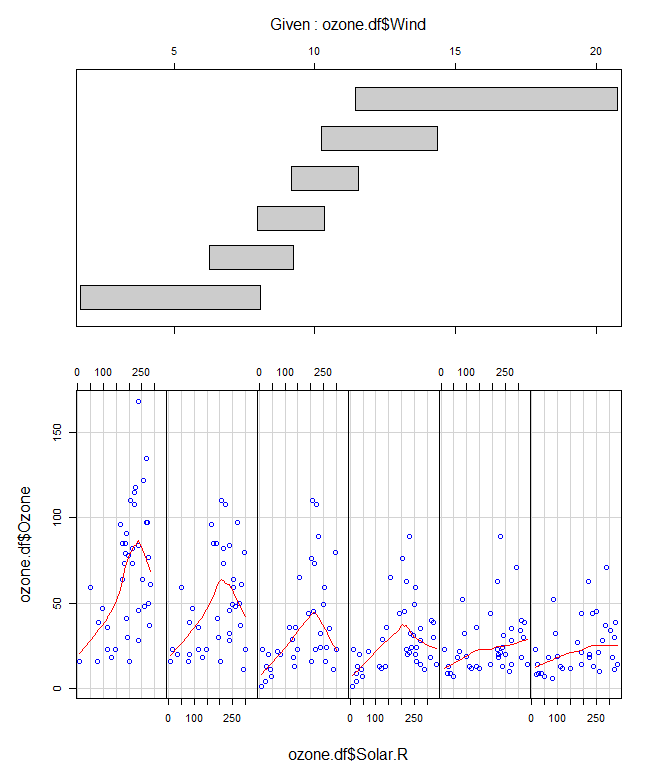
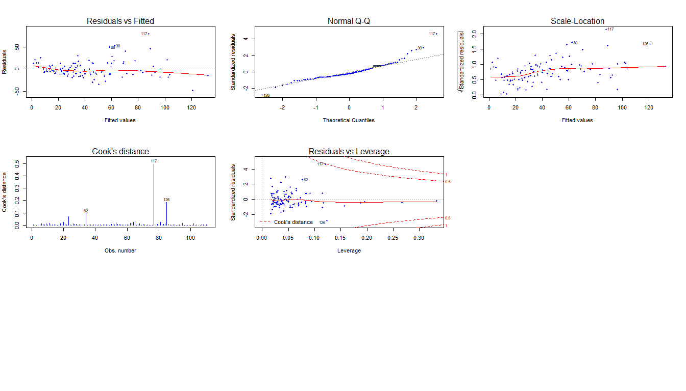
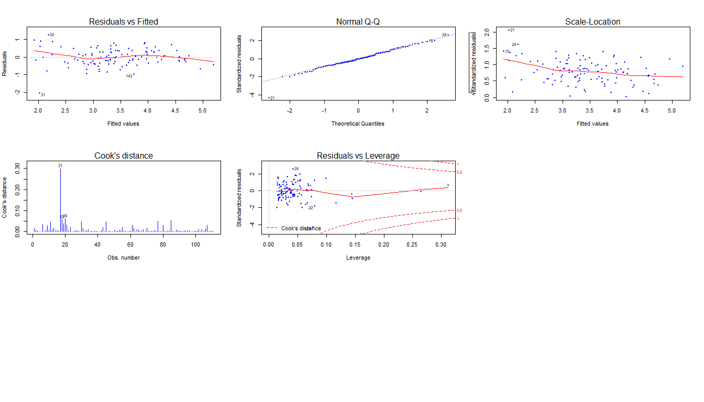

Interactions on Air Quality Data
================
Tapas Mishra
05/05/2019

Interactions may be useful to model in situations where the impact of
one factor may depend on the level of another factor.

Interactions can involve just factors, just numeric regressors or both
factors and numeric regressors.

In this study , we will try to understand , how tree’s can be useful to
get some some insights on interactions among explantory variables. We
will use air quality dataset for our analysis. We will evaluate how
ozone concentration is related to solar rediation , wind and
temperature.

Let us start by looking at the summary of dataset.

``` r
ozone.df = airquality[,1:4]
summary(ozone.df)
```

    ##      Ozone           Solar.R           Wind             Temp      
    ##  Min.   :  1.00   Min.   :  7.0   Min.   : 1.700   Min.   :56.00  
    ##  1st Qu.: 18.00   1st Qu.:115.8   1st Qu.: 7.400   1st Qu.:72.00  
    ##  Median : 31.50   Median :205.0   Median : 9.700   Median :79.00  
    ##  Mean   : 42.13   Mean   :185.9   Mean   : 9.958   Mean   :77.88  
    ##  3rd Qu.: 63.25   3rd Qu.:258.8   3rd Qu.:11.500   3rd Qu.:85.00  
    ##  Max.   :168.00   Max.   :334.0   Max.   :20.700   Max.   :97.00  
    ##  NA's   :37       NA's   :7

``` r
dim(ozone.df)
```

    ## [1] 153   4

At initial look , most of the data looks consistent. Lets start by a
pair plot.

``` r
pairs(ozone.df, panel = panel.smooth)
```

<!-- -->

At first look , we can see that , that ozone has string negative
relationship with wind speed , somewhat positive relationship with Temp
and a unclear or humped relationship with solar radiations.

Let us create a simple multiple regression model using glm and
understand some relationships.

``` r
ozone.lm = lm (Ozone ~ Solar.R + Wind + Temp , data = ozone.df )
summary(ozone.lm)
```

    ## 
    ## Call:
    ## lm(formula = Ozone ~ Solar.R + Wind + Temp, data = ozone.df)
    ## 
    ## Residuals:
    ##     Min      1Q  Median      3Q     Max 
    ## -40.485 -14.219  -3.551  10.097  95.619 
    ## 
    ## Coefficients:
    ##              Estimate Std. Error t value Pr(>|t|)    
    ## (Intercept) -64.34208   23.05472  -2.791  0.00623 ** 
    ## Solar.R       0.05982    0.02319   2.580  0.01124 *  
    ## Wind         -3.33359    0.65441  -5.094 1.52e-06 ***
    ## Temp          1.65209    0.25353   6.516 2.42e-09 ***
    ## ---
    ## Signif. codes:  0 '***' 0.001 '**' 0.01 '*' 0.05 '.' 0.1 ' ' 1
    ## 
    ## Residual standard error: 21.18 on 107 degrees of freedom
    ##   (42 observations deleted due to missingness)
    ## Multiple R-squared:  0.6059, Adjusted R-squared:  0.5948 
    ## F-statistic: 54.83 on 3 and 107 DF,  p-value: < 2.2e-16

So the overall p-value for f-statistic is very low , which suggest , all
these predictors are required in the model, that is rejecting the null
hypothsis of these predictors have zero cofficients. Then , individual
variables are significant . Although 42 missing values are deleted , we
would live with that for now. We also see, Wind has negative cofficient
, suggesting a negative relationship with Ozone levels.

Now . lets check the residual vs fitted plot for this model to check the
error dispersion.

``` r
plot(ozone.lm, which = 1, col = "blue")
```

<!-- -->

So , we see that model do not satisfy independent errors constant
variance assumption of linear model. This is first indication , that
there might be some more relationships in underlying data. This
indicates that regression surface is non linear.

Additive models can be used to check the nature of curvature in the
regression surface. gam models are used , with transformations can be
set to “smo0thers” , which is estimated by function. The curvature
suggests type of transformations, that could be applied to explaintory
variables.

``` r
library(mgcv)
```

    ## Loading required package: nlme

    ## This is mgcv 1.8-28. For overview type 'help("mgcv-package")'.

``` r
par(mfrow=c(2,2)) 
ozone.gam = gam(Ozone ~ s(Solar.R) + s(Wind) + s(Temp), data = ozone.df)
plot(ozone.gam, residuals = T , pch= 20, col="blue")
```

<!-- -->

A clear non-linear relationship can be seen in wind.

``` r
library(tree)
ozone.tree<-tree(Ozone~.,data=ozone.df) 
plot(ozone.tree, col = "blue") 
text(ozone.tree) 
```

<!-- -->

``` r
coplot(ozone.df$Ozone~ ozone.df$Solar.R|ozone.df$Wind, col="blue",panel=panel.smooth, row=1)
```

<!-- -->

    ## 
    ##  Missing rows: 5, 6, 10, 11, 25, 26, 27, 32, 33, 34, 35, 36, 37, 39, 42, 43, 45, 46, 52, 53, 54, 55, 56, 57, 58, 59, 60, 61, 65, 72, 75, 83, 84, 96, 97, 98, 102, 103, 107, 115, 119, 150

So, now let us add interaction terms and square terms in the model . We
will apply sequential elimination process to find the optimum model for
this
data.

``` r
ozone.lm<-lm(Ozone~Temp*Wind*Solar.R+I(Solar.R^2)+I(Temp^2)+I(Wind^2), data = ozone.df)
summary(ozone.lm) 
```

    ## 
    ## Call:
    ## lm(formula = Ozone ~ Temp * Wind * Solar.R + I(Solar.R^2) + I(Temp^2) + 
    ##     I(Wind^2), data = ozone.df)
    ## 
    ## Residuals:
    ##     Min      1Q  Median      3Q     Max 
    ## -38.879 -11.231  -2.706   8.824  70.546 
    ## 
    ## Coefficients:
    ##                     Estimate Std. Error t value Pr(>|t|)    
    ## (Intercept)        5.670e+02  2.077e+02   2.730  0.00748 ** 
    ## Temp              -1.073e+01  4.308e+00  -2.491  0.01439 *  
    ## Wind              -3.232e+01  1.176e+01  -2.749  0.00709 ** 
    ## Solar.R           -3.140e-01  5.593e-01  -0.561  0.57581    
    ## I(Solar.R^2)      -3.610e-04  2.576e-04  -1.401  0.16421    
    ## I(Temp^2)          5.815e-02  2.399e-02   2.424  0.01715 *  
    ## I(Wind^2)          6.095e-01  1.473e-01   4.138 7.32e-05 ***
    ## Temp:Wind          2.373e-01  1.370e-01   1.733  0.08624 .  
    ## Temp:Solar.R       8.433e-03  7.523e-03   1.121  0.26499    
    ## Wind:Solar.R       2.063e-02  4.899e-02   0.421  0.67450    
    ## Temp:Wind:Solar.R -4.340e-04  6.605e-04  -0.657  0.51264    
    ## ---
    ## Signif. codes:  0 '***' 0.001 '**' 0.01 '*' 0.05 '.' 0.1 ' ' 1
    ## 
    ## Residual standard error: 17.84 on 100 degrees of freedom
    ##   (42 observations deleted due to missingness)
    ## Multiple R-squared:  0.7387, Adjusted R-squared:  0.7126 
    ## F-statistic: 28.27 on 10 and 100 DF,  p-value: < 2.2e-16

We see , that individual terms are significant , as we saw in our base
model. The square terms for Temp and Wind are also significant. Since lm
is based on added variable test, that means , every variable has sense
to be in model , based on the variables added before. So we should not
simply remove more than 1 non - significant terms straightforward,
because removing a variable involved in any relationship, may make other
variable significant for the model. However , we will first remove 3
interaction term , because both it make model too complex and it is also
non-significant.

``` r
ozone.lm2 = update(ozone.lm,~. -Temp:Wind:Solar.R) 
summary(ozone.lm2)
```

    ## 
    ## Call:
    ## lm(formula = Ozone ~ Temp + Wind + Solar.R + I(Solar.R^2) + I(Temp^2) + 
    ##     I(Wind^2) + Temp:Wind + Temp:Solar.R + Wind:Solar.R, data = ozone.df)
    ## 
    ## Residuals:
    ##     Min      1Q  Median      3Q     Max 
    ## -39.596 -11.481  -2.904   8.540  70.325 
    ## 
    ## Coefficients:
    ##                Estimate Std. Error t value Pr(>|t|)    
    ## (Intercept)   5.229e+02  1.960e+02   2.668  0.00888 ** 
    ## Temp         -1.018e+01  4.214e+00  -2.416  0.01749 *  
    ## Wind         -2.795e+01  9.666e+00  -2.891  0.00470 ** 
    ## Solar.R       2.527e-02  2.145e-01   0.118  0.90642    
    ## I(Solar.R^2) -3.378e-04  2.545e-04  -1.328  0.18731    
    ## I(Temp^2)     5.935e-02  2.385e-02   2.488  0.01447 *  
    ## I(Wind^2)     6.161e-01  1.465e-01   4.204 5.68e-05 ***
    ## Temp:Wind     1.728e-01  9.515e-02   1.816  0.07238 .  
    ## Temp:Solar.R  3.764e-03  2.462e-03   1.529  0.12948    
    ## Wind:Solar.R -1.129e-02  6.288e-03  -1.795  0.07570 .  
    ## ---
    ## Signif. codes:  0 '***' 0.001 '**' 0.01 '*' 0.05 '.' 0.1 ' ' 1
    ## 
    ## Residual standard error: 17.79 on 101 degrees of freedom
    ##   (42 observations deleted due to missingness)
    ## Multiple R-squared:  0.7376, Adjusted R-squared:  0.7142 
    ## F-statistic: 31.54 on 9 and 101 DF,  p-value: < 2.2e-16

Now, we remove Temp:Solar.R interaction as it has highest p-value among
non-significant variables.

``` r
ozone.lm3 = update(ozone.lm2,~. -Temp:Solar.R) 
summary(ozone.lm3)
```

    ## 
    ## Call:
    ## lm(formula = Ozone ~ Temp + Wind + Solar.R + I(Solar.R^2) + I(Temp^2) + 
    ##     I(Wind^2) + Temp:Wind + Wind:Solar.R, data = ozone.df)
    ## 
    ## Residuals:
    ##     Min      1Q  Median      3Q     Max 
    ## -42.034 -11.987  -2.854   9.679  70.475 
    ## 
    ## Coefficients:
    ##                Estimate Std. Error t value Pr(>|t|)    
    ## (Intercept)   5.473e+02  1.966e+02   2.784  0.00640 ** 
    ## Temp         -1.141e+01  4.163e+00  -2.741  0.00723 ** 
    ## Wind         -2.869e+01  9.717e+00  -2.952  0.00392 ** 
    ## Solar.R       3.061e-01  1.114e-01   2.746  0.00712 ** 
    ## I(Solar.R^2) -2.677e-04  2.519e-04  -1.063  0.29041    
    ## I(Temp^2)     7.131e-02  2.268e-02   3.144  0.00218 ** 
    ## I(Wind^2)     6.351e-01  1.470e-01   4.321 3.61e-05 ***
    ## Temp:Wind     1.834e-01  9.552e-02   1.920  0.05768 .  
    ## Wind:Solar.R -1.384e-02  6.101e-03  -2.269  0.02539 *  
    ## ---
    ## Signif. codes:  0 '***' 0.001 '**' 0.01 '*' 0.05 '.' 0.1 ' ' 1
    ## 
    ## Residual standard error: 17.91 on 102 degrees of freedom
    ##   (42 observations deleted due to missingness)
    ## Multiple R-squared:  0.7315, Adjusted R-squared:  0.7104 
    ## F-statistic: 34.73 on 8 and 102 DF,  p-value: < 2.2e-16

Now, we remove Temp:Wind interaction as it has highest p-value among
non-significant variables.

``` r
ozone.lm4 = update(ozone.lm3,~. -Temp:Wind) 
summary(ozone.lm4)
```

    ## 
    ## Call:
    ## lm(formula = Ozone ~ Temp + Wind + Solar.R + I(Solar.R^2) + I(Temp^2) + 
    ##     I(Wind^2) + Wind:Solar.R, data = ozone.df)
    ## 
    ## Residuals:
    ##     Min      1Q  Median      3Q     Max 
    ## -45.135 -11.195  -2.557  10.270  77.369 
    ## 
    ## Coefficients:
    ##                Estimate Std. Error t value Pr(>|t|)    
    ## (Intercept)   2.307e+02  1.084e+02   2.129 0.035651 *  
    ## Temp         -5.438e+00  2.801e+00  -1.941 0.054956 .  
    ## Wind         -1.077e+01  2.747e+00  -3.922 0.000159 ***
    ## Solar.R       2.407e-01  1.075e-01   2.239 0.027293 *  
    ## I(Solar.R^2) -2.002e-04  2.527e-04  -0.792 0.430148    
    ## I(Temp^2)     4.482e-02  1.823e-02   2.458 0.015640 *  
    ## I(Wind^2)     4.299e-01  1.022e-01   4.207 5.54e-05 ***
    ## Wind:Solar.R -9.805e-03  5.802e-03  -1.690 0.094052 .  
    ## ---
    ## Signif. codes:  0 '***' 0.001 '**' 0.01 '*' 0.05 '.' 0.1 ' ' 1
    ## 
    ## Residual standard error: 18.14 on 103 degrees of freedom
    ##   (42 observations deleted due to missingness)
    ## Multiple R-squared:  0.7218, Adjusted R-squared:  0.7029 
    ## F-statistic: 38.17 on 7 and 103 DF,  p-value: < 2.2e-16

Now, we see that Wind:Solar.R interaction is also not significant , so
we would prune this term as well, simplifying our model further.

``` r
ozone.lm5 = update(ozone.lm4,~. -Wind:Solar.R) 
summary(ozone.lm5)
```

    ## 
    ## Call:
    ## lm(formula = Ozone ~ Temp + Wind + Solar.R + I(Solar.R^2) + I(Temp^2) + 
    ##     I(Wind^2), data = ozone.df)
    ## 
    ## Residuals:
    ##     Min      1Q  Median      3Q     Max 
    ## -48.698 -10.926  -3.786   9.201  79.932 
    ## 
    ## Coefficients:
    ##                Estimate Std. Error t value Pr(>|t|)    
    ## (Intercept)   2.984e+02  1.016e+02   2.937  0.00408 ** 
    ## Temp         -6.585e+00  2.742e+00  -2.402  0.01808 *  
    ## Wind         -1.334e+01  2.308e+00  -5.783 7.79e-08 ***
    ## Solar.R       1.347e-01  8.806e-02   1.529  0.12919    
    ## I(Solar.R^2) -2.044e-04  2.549e-04  -0.802  0.42444    
    ## I(Temp^2)     5.223e-02  1.786e-02   2.925  0.00423 ** 
    ## I(Wind^2)     4.642e-01  1.010e-01   4.594 1.22e-05 ***
    ## ---
    ## Signif. codes:  0 '***' 0.001 '**' 0.01 '*' 0.05 '.' 0.1 ' ' 1
    ## 
    ## Residual standard error: 18.3 on 104 degrees of freedom
    ##   (42 observations deleted due to missingness)
    ## Multiple R-squared:  0.7141, Adjusted R-squared:  0.6976 
    ## F-statistic: 43.29 on 6 and 104 DF,  p-value: < 2.2e-16

Now , we still find that square term for solar radiation is still
non-significant, so we would remove this term as well.

``` r
ozone.lm6 = update(ozone.lm5,~. -I(Solar.R^2)) 
summary(ozone.lm6)
```

    ## 
    ## Call:
    ## lm(formula = Ozone ~ Temp + Wind + Solar.R + I(Temp^2) + I(Wind^2), 
    ##     data = ozone.df)
    ## 
    ## Residuals:
    ##     Min      1Q  Median      3Q     Max 
    ## -48.017 -10.810  -4.144   8.120  80.125 
    ## 
    ## Coefficients:
    ##              Estimate Std. Error t value Pr(>|t|)    
    ## (Intercept) 291.09564  101.00727   2.882  0.00479 ** 
    ## Temp         -6.34116    2.72014  -2.331  0.02165 *  
    ## Wind        -13.37647    2.30330  -5.808 6.83e-08 ***
    ## Solar.R       0.06593    0.02007   3.285  0.00139 ** 
    ## I(Temp^2)     0.05104    0.01777   2.873  0.00492 ** 
    ## I(Wind^2)     0.46372    0.10087   4.597 1.20e-05 ***
    ## ---
    ## Signif. codes:  0 '***' 0.001 '**' 0.01 '*' 0.05 '.' 0.1 ' ' 1
    ## 
    ## Residual standard error: 18.27 on 105 degrees of freedom
    ##   (42 observations deleted due to missingness)
    ## Multiple R-squared:  0.7123, Adjusted R-squared:  0.6986 
    ## F-statistic: 51.99 on 5 and 105 DF,  p-value: < 2.2e-16

Now, that we have found all our current terms significant in the model ,
we would run diagnostics to check the model assumptions.

``` r
par(mfrow=c(3,3))
plot(ozone.lm6, which=1:5, pch =20, col="blue")
```

<!-- -->
Residual vs fitted plot , shows funnel effect, that is variance
increases with mean of fitted values. QQ plot also shows, non-normality
in errors, as it is right skewed. Cook’s distance plot captures
influential points. an observation which is more than 0.5 in cook’s
distance plot is considered to be influential point. Observation 117 is
although close , but not influential. Residual Vs leverage plot , do not
shows any obervation at extreme top right or extreme low right,
suggesting there are no outliers and leverage points. An observation ,
with high residual deviance are called outlier , and an observation ,
which is unusual and can have high impact on fitter values are called
HLP(High leverage points). An observation , which is both outlier and
HLP are called Influential points.

So ,we already tried transforming regressors, adding interaction terms,
checking multi-collinearity, we would now try to transform response , in
order to meet error assumptions.

Because , response does not have any zero values , we can try log
model.

``` r
ozone.lm7 = lm(log(Ozone) ~ Temp + Wind + Solar.R + I(Temp^2) + I(Wind^2), data = ozone.df)
summary(ozone.lm7) 
```

    ## 
    ## Call:
    ## lm(formula = log(Ozone) ~ Temp + Wind + Solar.R + I(Temp^2) + 
    ##     I(Wind^2), data = ozone.df)
    ## 
    ## Residuals:
    ##      Min       1Q   Median       3Q      Max 
    ## -2.09274 -0.28304 -0.02998  0.33226  1.23025 
    ## 
    ## Coefficients:
    ##               Estimate Std. Error t value Pr(>|t|)    
    ## (Intercept)  2.5512542  2.7367576   0.932  0.35336    
    ## Temp        -0.0040703  0.0737011  -0.055  0.95606    
    ## Wind        -0.2087092  0.0624072  -3.344  0.00114 ** 
    ## Solar.R      0.0025629  0.0005439   4.712 7.55e-06 ***
    ## I(Temp^2)    0.0003309  0.0004813   0.687  0.49335    
    ## I(Wind^2)    0.0067366  0.0027331   2.465  0.01533 *  
    ## ---
    ## Signif. codes:  0 '***' 0.001 '**' 0.01 '*' 0.05 '.' 0.1 ' ' 1
    ## 
    ## Residual standard error: 0.495 on 105 degrees of freedom
    ##   (42 observations deleted due to missingness)
    ## Multiple R-squared:  0.6881, Adjusted R-squared:  0.6732 
    ## F-statistic: 46.32 on 5 and 105 DF,  p-value: < 2.2e-16

In log model , we see square term for temp has become non-significant,
so removing this
term.

``` r
ozone.lm8 = lm(log(Ozone) ~ Temp + Wind + Solar.R  + I(Wind^2), data = ozone.df)
summary(ozone.lm8)
```

    ## 
    ## Call:
    ## lm(formula = log(Ozone) ~ Temp + Wind + Solar.R + I(Wind^2), 
    ##     data = ozone.df)
    ## 
    ## Residuals:
    ##      Min       1Q   Median       3Q      Max 
    ## -2.02427 -0.27460 -0.00085  0.31299  1.28248 
    ## 
    ## Coefficients:
    ##               Estimate Std. Error t value Pr(>|t|)    
    ## (Intercept)  0.7235113  0.6464665   1.119 0.265594    
    ## Temp         0.0464233  0.0059942   7.745 6.04e-12 ***
    ## Wind        -0.2204238  0.0598857  -3.681 0.000368 ***
    ## Solar.R      0.0025308  0.0005405   4.682 8.44e-06 ***
    ## I(Wind^2)    0.0072234  0.0026332   2.743 0.007145 ** 
    ## ---
    ## Signif. codes:  0 '***' 0.001 '**' 0.01 '*' 0.05 '.' 0.1 ' ' 1
    ## 
    ## Residual standard error: 0.4937 on 106 degrees of freedom
    ##   (42 observations deleted due to missingness)
    ## Multiple R-squared:  0.6867, Adjusted R-squared:  0.6748 
    ## F-statistic: 58.07 on 4 and 106 DF,  p-value: < 2.2e-16

Now , let us check diagnostics.

``` r
par(mfrow=c(3,3)) 
plot(ozone.lm8, which = 1:5, pch=20, col="blue")
```

<!-- -->

We see , funnel effect in residual vs fitted plot have subsided. QQ plot
, shows normality Cook’s distance plot , does not shows any observations
greater than 0.5, so no influential data point. Same , goes with
Residual vs leverage plot.

Therefore, we can now say, that we have reached to a optimal model to
better explain our data, after multiple iterations. We can utilizemodel
,

Log(ozone) = 0.72 - 0.05 \* Temp + 0.22 \* Wind + 0.002 \* Solar.R +
0.007 \* (Wind)^2

to determine impact of any of these regressors on ozone levels or to
predict ozone levels for a given values of Temp, Wind speed and Solar
radiation.
