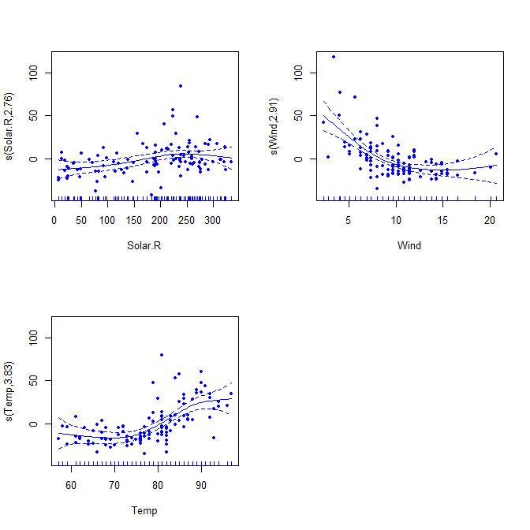

Interactions on Air Quality
================
Tapas Mishra
05/05/2019

Interactions may be useful to model in situations where the impact of
one factor may depend on the level of another factor.

Interactions can involve just factors, just numeric regressors or both
factors and numeric regressors.

In this study , we will try to understand , how tree’s can be useful to
get some some insights on interactions among explantory variables. We
will use air quality dataset for our analysis. We will how ozone
concentration is related to solar rediation , wind and temperature.

Let us start by looking at the summary of dataset.

``` r
ozone.df = airquality[,1:4]
summary(ozone.df)
```

    ##      Ozone           Solar.R           Wind             Temp      
    ##  Min.   :  1.00   Min.   :  7.0   Min.   : 1.700   Min.   :56.00  
    ##  1st Qu.: 18.00   1st Qu.:115.8   1st Qu.: 7.400   1st Qu.:72.00  
    ##  Median : 31.50   Median :205.0   Median : 9.700   Median :79.00  
    ##  Mean   : 42.13   Mean   :185.9   Mean   : 9.958   Mean   :77.88  
    ##  3rd Qu.: 63.25   3rd Qu.:258.8   3rd Qu.:11.500   3rd Qu.:85.00  
    ##  Max.   :168.00   Max.   :334.0   Max.   :20.700   Max.   :97.00  
    ##  NA's   :37       NA's   :7

At initial look , most of the data looks consistent. Lets start by a
pair plot.

``` r
pairs(ozone.df, panel = panel.smooth)
```

<!-- -->

At first look , we can see that , that ozone has string negative
relationship with wind speed , somewhat positive relationship with Temp
and a unclear or humped relationship with solar radiations.

Let us create a simple multiple regression model using glm and
understand some relationships.

``` r
ozone.lm = lm (Ozone ~ Solar.R + Wind + Temp , data = ozone.df )
summary(ozone.lm)
```

    ## 
    ## Call:
    ## lm(formula = Ozone ~ Solar.R + Wind + Temp, data = ozone.df)
    ## 
    ## Residuals:
    ##     Min      1Q  Median      3Q     Max 
    ## -40.485 -14.219  -3.551  10.097  95.619 
    ## 
    ## Coefficients:
    ##              Estimate Std. Error t value Pr(>|t|)    
    ## (Intercept) -64.34208   23.05472  -2.791  0.00623 ** 
    ## Solar.R       0.05982    0.02319   2.580  0.01124 *  
    ## Wind         -3.33359    0.65441  -5.094 1.52e-06 ***
    ## Temp          1.65209    0.25353   6.516 2.42e-09 ***
    ## ---
    ## Signif. codes:  0 '***' 0.001 '**' 0.01 '*' 0.05 '.' 0.1 ' ' 1
    ## 
    ## Residual standard error: 21.18 on 107 degrees of freedom
    ##   (42 observations deleted due to missingness)
    ## Multiple R-squared:  0.6059, Adjusted R-squared:  0.5948 
    ## F-statistic: 54.83 on 3 and 107 DF,  p-value: < 2.2e-16

So the overall p-value for f-statistic is very low , which suggest , all
these predictors are required in the model, that is rejecting the null
hypothsis of these predictors have zero cofficients. Then , individual
variables are significant . Although 42 missing values are deleted , we
would live with that for now. We also see, Wind has negative cofficient
, suggesting a negative relationship with Ozone levels.

Now . lets check the residual vs fitted plot for this model to check the
error dispersion.

``` r
plot(ozone.lm, which = 1, col = "blue")
```

<!-- -->

So , we see that model do not satify independent errors constant
variance assumption of linear model. This is first indication , that
there might be some more relationships in underlying data. This
indicates that regression surface is non linear.

Additive models can be used to check the nature of curvature in the
regression surface. gam models are used , with transformations can be
set to “smothers” , which is estimated by function. The curvature
suggests type of transformations, that could be applied to explaintory
variables.

``` r
library(mgcv)
```

    ## Loading required package: nlme

    ## This is mgcv 1.8-28. For overview type 'help("mgcv-package")'.

``` r
par(mfrow=c(2,2)) 
ozone.gam = gam(Ozone ~ s(Solar.R) + s(Wind) + s(Temp), data = ozone.df)
plot(ozone.gam, residuals = T , pch= 20)
```

<!-- -->
